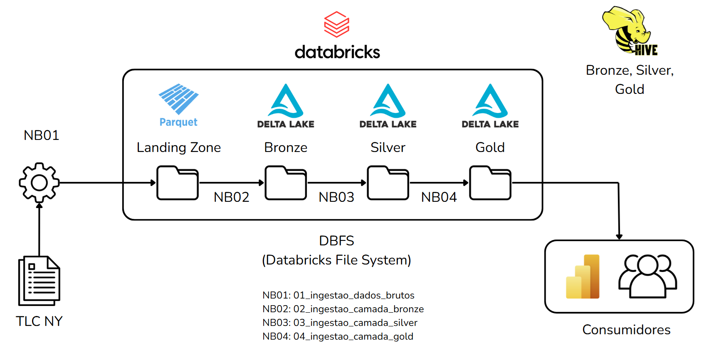
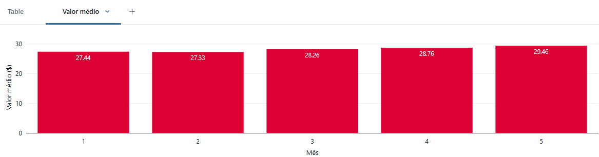
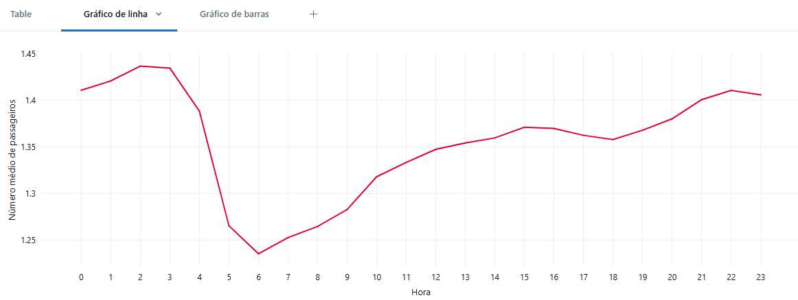
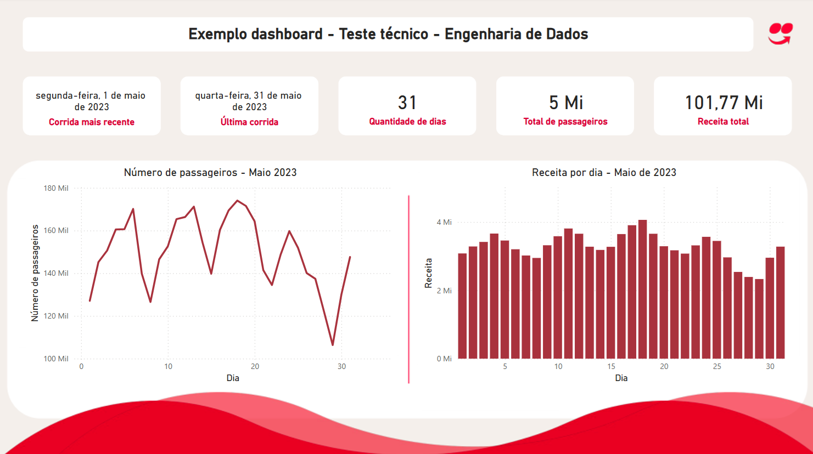

<!--
Autor: Pedro Henrique Resende Ribeiro
Descricao: Desafio tecnico - Engenharia de dados iFood
Date: 2025-07-02 - Time: 00:00
-->

# Desafio técnico - Data Engineer iFood

Este projeto foi desenvolvido como parte do processo seletivo para a vaga de Engenheiro de Dados Pleno no iFood. O desafio tem como objetivo demonstrar habilidades técnicas relacionadas à ingestão, processamento, modelagem e análise de dados em larga escala, utilizando tecnologias modernas de engenharia de dados.

Os dados utilizados são referentes às corridas de táxi da cidade de Nova York, disponibilizados publicamente pela [Taxi & Limousine Commission](https://www.nyc.gov/site/tlc/about/tlc-trip-record-data.page). A solução foi implementada no ambiente Databricks Community Edition, utilizando PySpark para o processamento distribuído e estruturada em múltiplas camadas de um data lakehouse (bronze, silver e gold).

Além disso, decidi acrescentar ao desafio:

- Exemplo de DAG para orquestração com Apache Airflow.
- Código para consumir a API da [NYC OpenData](https://data.cityofnewyork.us/browse?Data-Collection_Data-Collection=TLC+Trip+Data&sortBy=relevance&pageSize=20&page=1).
- Dashboard no Power BI para simular o consumo da camada gold.

## Índice

- [Como executar a solução](#como-executar-a-solução)
- [Parte 1 - Ingestão dos dados](#parte-1---ingestão-dos-dados)
    - [Ingestão dos dados da TLC](#ingestão-dos-dados-da-tlc)
    - [Ingestão na camada bronze](#ingestão-na-camada-bronze)
    - [Ingestão na camada silver](#ingestão-na-camada-silver)
    - [Ingestão na camada gold](#ingestão-na-camada-gold)
- [Parte 2 - Análise dos dados](#parte-2---análise-dos-dados)
    - [Pergunta 1: Média do valor total por mês](#pergunta-1-média-do-valor-total-por-mês)
    - [Pergunta 2: Média do número de passageiros por hora em maio](#pergunta-2-média-do-número-de-passageiros-por-hora-em-maio)
- [Parte 3 - Materiais extras](#parte-3---materiais-extras)
    - [DAG para orquestração com Airflow](#dag-para-orquestração-das-etapas-de-ingestão-de-dados)
    - [Consumo da API da NYC OpenData](#consumo-de-api-da-nyc-opendata)
    - [Dashboard no Power BI](#dashboard-no-power-bi)
- [Agradecimento](#agradecimento)

## Como executar a solução

Abaixo estão os passos para executar a solução completa do desafio técnico no ambiente Databricks:

**1. Clonar o repositório**

Clone este repositório para acessar os notebooks e arquivos utilizados:

```bash
git clone git@github.com:pedro-hr-resende/ifood-case.git
```

**2. Importar os notebooks para o Databricks**

- Acesse o Databricks.
- Vá até a aba Workspace > Import.
- Faça o upload dos notebooks da pasta /notebooks do repositório.
- Mantenha a ordem numérica dos notebooks para seguir o fluxo da pipeline.

**3. Configurar o cluster**

Crie e inicie um cluster com as seguintes configurações mínimas mostradas abaixo.

- Runtime: Databricks Runtime 12.2 LTS ou superior (com suporte a Spark 3.x)
- Linguagem principal: Python
- Modo de cluster: Single Node (ou padrão para testes)

**4. Instalação das bibliotecas necessárias**

Antes de rodar os notebooks é preciso instalar as bibliotecas necessárias. Para isso, importe o arquivo `requirements.txt`para o DBFS e execute os comandos abaixo.

```bash
dbutils.fs.cp("dbfs:/FileStore/requirements.txt", "file:/tmp/requirements.txt")
!pip install -r /tmp/requirements.txt
```

**5. Executar os notebooks na ordem abaixo**

Cada notebook representa uma etapa da pipeline:

- [01_ingestao_landing_zone.ipynb](./src/01_ingestao_arquivos_brutos.ipynb) – Faz o download dos dados brutos (parquet) da NYC Taxi e salva na landing zone.
- [02_bronze.ipynb](./src/02_ingestao_camada_bronze.ipynb) – Ingestão dos dados brutos em tabelas Delta da camada bronze.
- [03_silver.ipynb](./src/03_ingestao_camada_silver.ipynb) – Limpeza e padronização dos dados na camada silver.
- [04_gold.ipynb](./src/04_ingestao_camada_gold.ipynb) – Criação da modelagem final com tabelas otimizadas para análise.
- [05_analise_dados.ipynb](./analysis/05_analise_dados_taxi.ipynb) – Geração de análises e visualizações básicas em PySpark.

Os notebooks

- [06_consumo_api.ipynb](./extra/codigos/06_extra-dag_airflow.ipynb) – Exemplo de consumo de dados via API pública da NYC.
- [07_airflow_dag_exemplo.py](./extra/codigos/07_extra_consumo_api.ipynb) – Exemplo de DAG para orquestração das etapas (para rodar em ambiente com Airflow).

não fazem parte do enunciado do desafio técnico, mas complementam a solução. O notebook 6 não pode ser executado no Databricks, mas o notebook 7 pode ser executado da mesma forma como os demais.

[voltar ao índice](#índice)

## Parte 1 - Ingestão dos dados

O diagrama de arquitetura da solução é mostrado na Figura 1.

<p align='center'>
<br>
Figura 1: Diagrama de arquitetura
</p>

### Ingestão dos dados da TLC

Nesta primeira etapa da pipeline, foi realizada a ingestão dos dados brutos dos serviços de táxi da cidade de Nova York, disponibilizados publicamente pela NYC Taxi & Limousine Commission (TLC). Os arquivos estão no formato `.parquet` e são acessados diretamente de uma URL pública (CloudFront).

O processo consiste em:

- Definir os tipos de táxi a serem utilizados na análise:
    - Yellow (amarelo)
    - Green (verde)
    - FHV (For-Hire Vehicles)
    - FHVHV (High Volume For-Hire Vehicles)
- Selecionar o intervalo de datas desejado, neste caso de janeiro a maio de 2023.
- Fazer o download dos arquivos Parquet diretamente da web, utilizando a biblioteca requests.
- Salvar os arquivos na `landing zone`, que neste projeto é simulado por um diretório no DBFS.

Essa etapa tem como objetivo centralizar os dados brutos em um local comum e padronizado, criando um ponto único de entrada para a pipeline de dados. Nenhuma transformação é feita nesse momento — os dados são apenas baixados e armazenados como estão.

### Ingestão na camada bronze

A camada bronze é a primeira camada estruturada do data lake. Ela tem como objetivo armazenar os dados brutos de forma confiável e imutável, servindo como uma réplica fiel dos dados originais da landing zone, mas agora dentro do Delta Lake.

Nesta etapa, foi realizado:

- Leitura dos arquivos parquet da landing zone, que foram previamente baixados da NYC Open Data.
- Escrita dos dados em formato Delta, o que permite versionamento, transações ACID e otimizações de leitura.
- Criação das tabelas Delta no metastore do Databricks, organizadas por tipo de serviço de táxi (yellow, green, fhv, fhvhv).

Os dados foram armazenado em um diretório nomeado por 'bronze'. Dessa forma, podemos simular o uso de um bucket S3 no Databricks Community Edition.

### Ingestão na camada silver

A camada silver representa a etapa de limpeza e padronização dos dados brutos da camada bronze. Aqui, os dados começam a ganhar qualidade para suportar análises e integrações mais confiáveis.

O que acontece na camada silver:

- Tratamento de dados inconsistentes ou duplicados — correções para melhorar a qualidade.
- Conversão e padronização de formatos de data, hora e outros campos relevantes para garantir uniformidade.
- Filtragem de registros inválidos ou fora do escopo de análise.
- Criação de partições que irão otimizar as consultas do dado analítico.

### Ingestão na camada gold

A camada gold representa a etapa final da pipeline de dados, onde os dados são modelados e otimizados para consumo analítico e tomada de decisão. Aqui, os dados provenientes da camada silver são transformados em tabelas e modelos prontos para uso por analistas, dashboards e aplicações.

Nela temos:

- Exclusão de colunas desnecessárias para a análise.
- Criação de colunas calculadas para enriquecer os dados.
- Disponibilização das tabelas para consumo via BI, APIs e outros sistemas.

[voltar ao índice](#índice)

## Parte 2 - Análise dos dados

Nesta etapa, utilizei os dados já modelados e otimizados da camada gold para realizar uma análise exploratória e validação da qualidade dos dados.

Validações realizadas:

- Verificação de dados duplicados, para evitar contagem ou análise incorreta de registros repetidos.
- Identificação de valores inválidos no campo total_amount, como valores menores que zero, que não fazem sentido em um contexto financeiro.
- Checagem do número de passageiros, identificando registros com valores nulos ou negativos, que indicam possíveis erros de coleta ou entrada de dados.
- Validação das datas das corridas, garantindo que a data de início não seja posterior à data de término, o que configuraria inconsistências temporais.

Realizar essas validações é essencial para manter a integridade e a qualidade dos dados, evitando que informações incorretas influenciem relatórios e decisões estratégicas. Além disso, identificar e corrigir essas inconsistências contribui para a construção de modelos preditivos mais precisos e confiáveis, além de garantir a confiança dos stakeholders no uso dos dados.

### Pergunta 1: Média do valor total por mês

A Figura 2 mostra o gráfico contendo os valores das médias do valor total das corridas por mês para os yellow taxis.

<p align='center'>
<br>
Figura 2: Valor médio por mês para os yellow taxis
</p>

### Pergunta 2: Média do número de passageiros por hora em maio

A Figura 3 mostra o gráfico contendo os valores das médias do número de passageiros por hora para o mês de maio considerando toda a frota de táxis.

<p align='center'>
<br>
Figura 3: Valor médio de passageiros por hora em maio
</p>

>**Observação:** Neste projeto, utilizei apenas os dados dos serviços Yellow e Green Taxi porque eles representam os táxis tradicionais de Nova York e contêm informações completas, como o número de passageiros e o valor total da corrida. Os dados de FHV e FHVHV não foram considerados por se referirem a serviços de transporte por aplicativo (como Uber e Lyft) e não incluírem o campo de número de passageiros, o que limita a análise e comparabilidade com os táxis convencionais.

[voltar ao índice](#índice)

## Parte 3 - Materiais extras

### DAG para orquestração com Airflow

Como trabalho extra, desenvolvi um exemplo de DAG (Directed Acyclic Graph) para demonstrar como seria a orquestração das etapas da pipeline de dados em um ambiente de produção usando o Airflow. A DAG simula a execução automatizada das seguintes etapas:

- Ingestão dos dados brutos (landing zone)
- Ingestão na camada bronze
- Transformação para a camada silver
- Modelagem final na camada gold

Cada etapa é representada por uma task independente, que pode executar notebooks ou scripts PySpark. O fluxo define claramente as dependências entre as tarefas e permite agendamento, etc.

O código pode ser visto no [notebook 06](./extra/codigos/06_extra-dag_airflow.ipynb).

### Consumo de API da NYC OpenData

Desenvolvi um notebook que demonstra o consumo da API pública da NYC Open Data, que disponibiliza dados em tempo real ou por requisição sob demanda. O objetivo desta etapa é mostrar como dados podem ser integrados à pipeline também via fontes dinâmicas (API REST), além dos arquivos estáticos. Para isso, utilizei a biblioteca `requests` em Python para fazer chamadas HTTP à API e capturar os dados em formato JSON.

O código pode ser visto no [notebook 07](./extra/codigos/07_extra_consumo_api.ipynb).

### Dashboard no Power BI

Para mostrar que é possível integrar uma ferramenta de visualização de dados na camada gold, desenvolvi um dashboard utilizando a ferramenta Power BI. O dashboard pode ser visto na Figura 4.

<p align='center'>
<br>
Figura 4: Dashboard que consome a camada gold
</p>

[voltar ao índice](#índice)

## Agradecimento

Gostaria de agradecer pela oportunidade de participar deste desafio técnico. A proposta foi muito interessante e me proporcionou um aprendizado significativo. Foi uma excelente oportunidade para aplicar conhecimentos de engenharia de dados em um cenário realista e com alto nível técnico.
